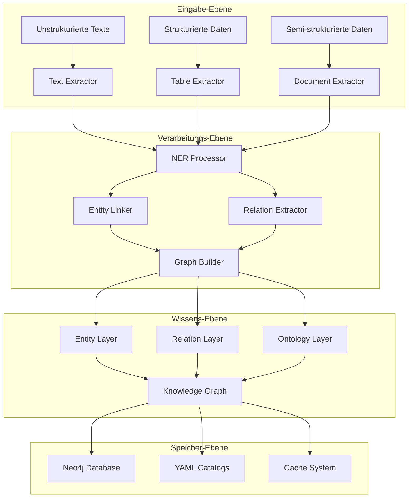

# AutoGraph Graph-Dokumentation

**Knowledge Graph Architektur, Algorithmen und Datenmodell**

---

## 📚 Inhaltsverzeichnis

- [🧠 Graph-Architektur](#-graph-architektur)
- [🏗️ Datenmodell](#️-datenmodell)
- [🔍 Entity-System](#-entity-system)
- [🕸️ Relation-System](#️-relation-system)
- [🎯 Ontologie-Integration](#-ontologie-integration)
- [⚡ Algorithmen](#-algorithmen)
- [🔍 Query-Patterns](#-query-patterns)
- [📊 Graph-Metriken](#-graph-metriken)
- [🛠️ Neo4j Integration](#️-neo4j-integration)

---

## 🧠 Graph-Architektur

AutoGraph implementiert eine **hybride Knowledge Graph-Architektur**, die strukturierte und unstrukturierte Datenverarbeitung kombiniert.

### 🏛️ Architektur-Ebenen



### 🎯 Design-Prinzipien

**1. Entity-Centric Design**
- Entitäten als zentrale Knoten
- Typisierte Entitäts-Hierarchien
- Multi-Domain Support

**2. Relation-First Approach**
- Explizite Beziehungsmodellierung
- Confidence-basierte Filterung
- Kontextuelle Relationen

**3. Ontology-Driven Structure**
- Schema.org Kompatibilität
- Custom Domain Ontologies
- Flexible Namespace-Verwaltung

**4. Temporal Awareness**
- Zeitstempel für alle Entitäten
- Versionierung von Relationen
- Historische Nachverfolgung

---

## 🏗️ Datenmodell

### 📊 Neo4j Schema

```cypher
// Entity Node Labels
CREATE CONSTRAINT entity_id IF NOT EXISTS FOR (e:Entity) REQUIRE e.id IS UNIQUE;
CREATE CONSTRAINT entity_canonical IF NOT EXISTS FOR (e:Entity) REQUIRE e.canonical_name IS NOT NULL;

// Relation Types mit Properties
CREATE INDEX rel_confidence IF NOT EXISTS FOR ()-[r:RELATES_TO]-() ON r.confidence;
CREATE INDEX rel_domain IF NOT EXISTS FOR ()-[r:RELATES_TO]-() ON r.domain;

// Ontology Nodes
CREATE CONSTRAINT class_uri IF NOT EXISTS FOR (c:OntologyClass) REQUIRE c.uri IS UNIQUE;
CREATE CONSTRAINT property_uri IF NOT EXISTS FOR (p:OntologyProperty) REQUIRE p.uri IS UNIQUE;
```

### 🏷️ Node-Types

#### **Entity Nodes**

```cypher
// Entity Node Structure
(:Entity {
  id: "uuid-string",                    // Eindeutige ID
  canonical_name: "Acetylsalicylsäure", // Kanonischer Name
  entity_type: "DRUG",                  // Entity-Typ
  domain: "medizin",                    // Domäne
  description: "Schmerzlinderung...",   // Beschreibung
  confidence: 0.95,                     // Erkennungsgenauigkeit
  
  // Metadaten
  created_at: 1721145600,               // Erstellungszeit
  updated_at: 1721145600,               // Letzte Aktualisierung
  source: "medical_text_001.txt",       // Quelle
  extraction_method: "bert_ner",        // Extraktionsmethode
  
  // Linking-Informationen
  linked: true,                         // Entity gelinkt?
  catalog: "custom_medizin",            // Quell-Katalog
  uri: "http://example.org/drugs/...",  // Externe URI
  
  // Linguistische Eigenschaften
  aliases: ["Aspirin", "ASS"],          // Alternative Namen
  surface_forms: ["aspirin", "Aspirin"], // Oberflächenformen
  language: "de",                       // Sprache
  
  // Domain-spezifische Properties
  properties: {                         // Zusätzliche Eigenschaften
    wirkstoff: "Acetylsalicylsäure",
    dosierung: "500mg",
    hersteller: "Bayer AG"
  }
})
```

#### **OntologyClass Nodes**

```cypher
(:OntologyClass {
  uri: "http://schema.org/Drug",
  name: "Drug",
  description: "A substance used as medication",
  namespace: "schema",
  parent_class: "http://schema.org/Substance",
  properties: ["name", "description", "dosage"]
})
```

#### **OntologyProperty Nodes**

```cypher
(:OntologyProperty {
  uri: "http://schema.org/activeIngredient",
  name: "activeIngredient",
  description: "The active ingredient in the drug",
  domain: ["Drug"],
  range: ["ChemicalSubstance"],
  namespace: "schema"
})
```

### 🔗 Relationship-Types

#### **Primary Relations**

```cypher
// Entity-zu-Entity Relationen
(:Entity)-[:RELATES_TO {
  relation_type: "hilft_gegen",      // Relation-Typ
  confidence: 0.87,                  // Vertrauenswert
  evidence: "Text-Analyse",          // Evidenz-Quelle
  context: "Patient nimmt...",       // Kontext
  domain: "medizin",                 // Domäne
  method: "hybrid",                  // Extraktionsmethode
  created_at: 1721145600,            // Zeitstempel
  
  // Linguistische Eigenschaften
  surface_form: "hilft gegen",       // Originalform im Text
  normalized_form: "hilft_gegen",    // Normalisierte Form
  
  // Temporal Properties
  temporal_marker: "aktuell",        // Zeitbezug
  duration: "dauerhafte_wirkung"     // Dauer
}]->(:Entity)

// Ontology-Mapping
(:Entity)-[:INSTANCE_OF]->(:OntologyClass)
(:Entity)-[:HAS_PROPERTY {
  property_value: "500mg",
  confidence: 0.9
}]->(:OntologyProperty)

// Hierarchical Relations
(:OntologyClass)-[:SUBCLASS_OF]->(:OntologyClass)
(:OntologyProperty)-[:SUBPROPERTY_OF]->(:OntologyProperty)
```

#### **Auxiliary Relations**

```cypher
// Co-occurrence Relations
(:Entity)-[:CO_OCCURS_WITH {
  frequency: 15,
  contexts: ["medical_text_001", "medical_text_045"],
  strength: 0.75
}]->(:Entity)

// Temporal Relations
(:Entity)-[:BEFORE]->(:Entity)
(:Entity)-[:AFTER]->(:Entity)
(:Entity)-[:DURING]->(:Entity)

// Spatial Relations
(:Entity)-[:LOCATED_AT]->(:Entity)
(:Entity)-[:CONTAINS]->(:Entity)
(:Entity)-[:PART_OF]->(:Entity)
```

---

## 🔍 Entity-System

### 🏷️ Entity-Typologie

AutoGraph unterstützt eine hierarchische Entity-Klassifikation:

```yaml
# Entity Type Hierarchy
PERSON:
  - PATIENT
  - DOCTOR
  - RESEARCHER
  
ORGANIZATION:
  - HOSPITAL
  - PHARMACEUTICAL_COMPANY
  - RESEARCH_INSTITUTE
  
SUBSTANCE:
  - DRUG:
      - NSAID
      - ANTIBIOTIC
      - ANALGESIC
  - CHEMICAL_COMPOUND
  
CONDITION:
  - DISEASE
  - SYMPTOM
  - SYNDROME
  
LOCATION:
  - ANATOMICAL_PART
  - GEOGRAPHICAL_LOCATION
  - FACILITY
  
TEMPORAL:
  - DATE
  - TIME_PERIOD
  - EVENT

MISC:
  - PROCEDURE
  - MEASUREMENT
  - CONCEPT
```

### 🎯 Entity Recognition Pipeline

```python
# Entity Recognition Workflow
def extract_entities(text, domain=None):
    """
    Multi-Stage Entity Recognition
    """
    
    # Stage 1: NER Models
    bert_entities = bert_ner_model.predict(text)
    spacy_entities = spacy_model(text).ents
    
    # Stage 2: Rule-Based Enhancement
    rule_entities = rule_based_extractor.extract(text, domain)
    
    # Stage 3: Entity Fusion
    fused_entities = entity_fusion(
        [bert_entities, spacy_entities, rule_entities],
        confidence_threshold=0.6
    )
    
    # Stage 4: Entity Linking
    linked_entities = entity_linker.link(fused_entities, domain)
    
    # Stage 5: Ontology Mapping
    mapped_entities = ontology_mapper.map(linked_entities, domain)
    
    return mapped_entities
```

### 🔗 Entity Linking Algorithmus

```python
def link_entity(entity_text, entity_type, domain, context=None):
    """
    Entity Linking mit Multiple Strategies
    """
    
    candidates = []
    
    # Strategy 1: Exact Match
    exact_matches = catalog.exact_match(entity_text, entity_type, domain)
    candidates.extend([(match, 1.0, "exact") for match in exact_matches])
    
    # Strategy 2: Fuzzy String Matching
    fuzzy_matches = catalog.fuzzy_match(entity_text, threshold=0.8)
    candidates.extend([(match, score, "fuzzy") for match, score in fuzzy_matches])
    
    # Strategy 3: Semantic Similarity
    if context:
        semantic_matches = embedding_model.semantic_match(
            entity_text, context, entity_type
        )
        candidates.extend([(match, score, "semantic") for match, score in semantic_matches])
    
    # Strategy 4: Alias Resolution
    alias_matches = catalog.resolve_aliases(entity_text, entity_type)
    candidates.extend([(match, score, "alias") for match, score in alias_matches])
    
    # Candidate Ranking
    ranked_candidates = rank_candidates(candidates, weights={
        "exact": 1.0,
        "fuzzy": 0.8, 
        "semantic": 0.7,
        "alias": 0.9
    })
    
    # Return Best Match
    if ranked_candidates and ranked_candidates[0][1] >= confidence_threshold:
        return create_entity_link(ranked_candidates[0])
    
    return None
```

---

## 🕸️ Relation-System

### 🔧 Relation Extraction Pipeline

AutoGraph verwendet einen **Hybrid-Ansatz** für Relation Extraction:

```python
class HybridRelationExtractor:
    """
    Kombination von ML und Rule-Based Approaches
    """
    
    def __init__(self):
        self.ml_model = BERTRelationClassifier()
        self.rule_engine = RelationRuleEngine()
        self.ensemble = EnsembleMethod()
    
    def extract_relations(self, text, entities, domain=None):
        """
        Multi-Method Relation Extraction
        """
        
        # ML-Based Extraction
        ml_relations = self.ml_model.predict(
            text, entities, confidence_threshold=0.65
        )
        
        # Rule-Based Extraction  
        rule_relations = self.rule_engine.apply_rules(
            text, entities, domain
        )
        
        # Ensemble Combination
        final_relations = self.ensemble.combine(
            ml_relations, 
            rule_relations,
            method="weighted_union",
            weights={"ml": 0.6, "rules": 0.4}
        )
        
        return final_relations
```

### 📋 Relation-Taxonomie

```yaml
# Domain-Specific Relations
medical_relations:
  treatment:
    - "behandelt_mit"
    - "therapiert_durch"
    - "verabreicht"
  
  causation:
    - "verursacht"
    - "führt_zu"
    - "bedingt"
  
  temporal:
    - "vor"
    - "nach"
    - "während"
  
  spatial:
    - "lokalisiert_in"
    - "betrifft"
    - "ausgebreitet_auf"

business_relations:
  ownership:
    - "gehört_zu"
    - "besitzt"
    - "kontrolliert"
  
  collaboration:
    - "kooperiert_mit"
    - "partnerschaft_mit"
    - "konkurriert_mit"
  
  financial:
    - "investiert_in"
    - "finanziert"
    - "kauft"
```

### 🎯 Relation Confidence Scoring

```python
def calculate_relation_confidence(relation, context):
    """
    Multi-Factor Confidence Scoring
    """
    
    scores = {}
    
    # Linguistic Features
    scores['syntactic'] = analyze_syntactic_pattern(relation, context)
    scores['semantic'] = analyze_semantic_coherence(relation, context)
    scores['lexical'] = analyze_lexical_signals(relation, context)
    
    # Context Features
    scores['entity_types'] = check_entity_type_compatibility(relation)
    scores['domain_fit'] = check_domain_consistency(relation, context.domain)
    scores['frequency'] = get_pattern_frequency(relation.pattern)
    
    # Evidence Features
    scores['evidence_strength'] = assess_textual_evidence(relation, context)
    scores['multi_source'] = check_multiple_sources(relation)
    
    # Combined Score
    weights = {
        'syntactic': 0.2,
        'semantic': 0.25,
        'lexical': 0.15,
        'entity_types': 0.15,
        'domain_fit': 0.1,
        'frequency': 0.05,
        'evidence_strength': 0.08,
        'multi_source': 0.02
    }
    
    final_score = sum(scores[factor] * weights[factor] for factor in scores)
    
    return min(max(final_score, 0.0), 1.0)
```

---

## 🎯 Ontologie-Integration

### 🏗️ Ontology Schema

AutoGraph verwendet **YAML-basierte Ontologien** mit Schema.org-Kompatibilität:

```yaml
# Medical Ontology Example
namespace: medical
namespace_uri: "http://autograph.medical/"
description: "Medical domain ontology for healthcare applications"

classes:
  Drug:
    description: "Pharmaceutical substance used for treatment"
    parent: "schema:Substance"
    properties:
      - "activeIngredient"
      - "dosage"
      - "indication"
      - "contraindication"
    aliases: ["Medication", "Medicine", "Pharmaceutical"]
  
  Condition:
    description: "Medical condition or disease"
    parent: "schema:MedicalCondition"
    properties:
      - "symptoms"
      - "causes"
      - "treatments"
    aliases: ["Disease", "Illness", "Disorder"]

relations:
  treats:
    description: "Drug treats medical condition"
    domain: ["Drug"]
    range: ["Condition"]
    inverse: "treatedBy"
    aliases: ["heals", "cures", "helps_with"]
  
  hasSymptom:
    description: "Condition has associated symptom"
    domain: ["Condition"]
    range: ["Symptom"]
    cardinality: "one-to-many"
```

### 🔄 Ontology Mapping Algorithmus

```python
def map_to_ontology(entity, entity_type, domain):
    """
    Entity-to-Ontology Mapping
    """
    
    mappings = []
    
    # 1. Direct Type Mapping
    if entity_type in ontology.classes:
        mappings.append({
            'class': f"{domain}:{entity_type}",
            'confidence': 1.0,
            'method': 'direct_type'
        })
    
    # 2. Semantic Similarity
    for class_name, class_def in ontology.classes.items():
        similarity = semantic_similarity(entity.text, class_def.description)
        if similarity > 0.7:
            mappings.append({
                'class': f"{domain}:{class_name}",
                'confidence': similarity,
                'method': 'semantic'
            })
    
    # 3. Alias Matching
    for class_name, class_def in ontology.classes.items():
        if entity.text.lower() in [alias.lower() for alias in class_def.aliases]:
            mappings.append({
                'class': f"{domain}:{class_name}",
                'confidence': 0.9,
                'method': 'alias'
            })
    
    # 4. Property-Based Inference
    if entity.properties:
        for class_name, class_def in ontology.classes.items():
            property_overlap = len(set(entity.properties.keys()) & 
                                 set(class_def.properties))
            if property_overlap > 0:
                confidence = property_overlap / len(class_def.properties)
                mappings.append({
                    'class': f"{domain}:{class_name}",
                    'confidence': confidence,
                    'method': 'property_inference'
                })
    
    # Return Top Mappings
    return sorted(mappings, key=lambda x: x['confidence'], reverse=True)[:3]
```

---

## ⚡ Algorithmen

### 🧠 Entity Resolution Algorithmus

```python
class EntityResolutionAlgorithm:
    """
    Advanced Entity Resolution mit Multiple Strategies
    """
    
    def resolve_entities(self, raw_entities):
        """
        Multi-Pass Entity Resolution
        """
        
        # Pass 1: String-Based Clustering
        string_clusters = self.string_based_clustering(raw_entities)
        
        # Pass 2: Type-Aware Merging
        type_merged = self.type_aware_merging(string_clusters)
        
        # Pass 3: Context-Based Disambiguation
        context_resolved = self.context_disambiguation(type_merged)
        
        # Pass 4: Temporal Consistency Check
        temporal_consistent = self.temporal_consistency(context_resolved)
        
        return temporal_consistent
    
    def string_based_clustering(self, entities):
        """
        Clustering basierend auf String-Ähnlichkeit
        """
        clusters = []
        for entity in entities:
            placed = False
            for cluster in clusters:
                if self.string_similarity(entity, cluster[0]) > 0.8:
                    cluster.append(entity)
                    placed = True
                    break
            if not placed:
                clusters.append([entity])
        return clusters
    
    def context_disambiguation(self, entities):
        """
        Kontext-basierte Disambiguierung
        """
        for entity in entities:
            if len(entity.candidates) > 1:
                # Berechne Kontext-Scores für jeden Kandidaten
                context_scores = []
                for candidate in entity.candidates:
                    score = self.context_similarity(
                        entity.context, 
                        candidate.typical_contexts
                    )
                    context_scores.append(score)
                
                # Wähle besten Kandidaten
                best_idx = max(enumerate(context_scores), key=lambda x: x[1])[0]
                entity.resolved_candidate = entity.candidates[best_idx]
        
        return entities
```

### 🕸️ Graph Construction Algorithmus

```python
class GraphConstructor:
    """
    Intelligente Knowledge Graph Konstruktion
    """
    
    def build_graph(self, entities, relations):
        """
        Optimierter Graph-Aufbau
        """
        
        graph = Neo4jGraph()
        
        # 1. Entity Nodes erstellen
        entity_nodes = self.create_entity_nodes(entities)
        graph.add_nodes(entity_nodes)
        
        # 2. Relation Filtering
        filtered_relations = self.filter_relations(
            relations, 
            confidence_threshold=0.6,
            coherence_check=True
        )
        
        # 3. Relation Edges erstellen
        relation_edges = self.create_relation_edges(filtered_relations)
        graph.add_edges(relation_edges)
        
        # 4. Graph Consistency Check
        self.consistency_check(graph)
        
        # 5. Graph Optimization
        optimized_graph = self.optimize_graph(graph)
        
        return optimized_graph
    
    def filter_relations(self, relations, confidence_threshold, coherence_check):
        """
        Multi-Criteria Relation Filtering
        """
        filtered = []
        
        for relation in relations:
            # Confidence Filter
            if relation.confidence < confidence_threshold:
                continue
            
            # Coherence Check
            if coherence_check and not self.check_coherence(relation):
                continue
            
            # Redundancy Filter
            if not self.is_redundant(relation, filtered):
                filtered.append(relation)
        
        return filtered
```

---

## 🔍 Query-Patterns

### 🎯 Standard Graph Queries

#### **Entity-Suche**

```cypher
// 1. Alle Medikamente finden
MATCH (e:Entity {entity_type: "DRUG", domain: "medizin"})
RETURN e.canonical_name, e.description, e.properties

// 2. Entitäten mit hoher Confidence
MATCH (e:Entity)
WHERE e.confidence > 0.9
RETURN e.canonical_name, e.entity_type, e.confidence
ORDER BY e.confidence DESC

// 3. Entity-Suche mit Fuzzy Matching
MATCH (e:Entity)
WHERE e.canonical_name =~ "(?i).*aspirin.*"
RETURN e
```

#### **Relation-Analyse**

```cypher
// 1. Alle Behandlungsrelationen
MATCH (drug:Entity {entity_type: "DRUG"})-[r:RELATES_TO {relation_type: "behandelt"}]->(condition:Entity)
RETURN drug.canonical_name, condition.canonical_name, r.confidence

// 2. Beziehungsnetzwerk einer Entität
MATCH (e:Entity {canonical_name: "Aspirin"})-[r:RELATES_TO]-(connected)
RETURN e, r, connected

// 3. Transitive Relationen (Behandlungsketten)
MATCH path = (drug:Entity)-[:RELATES_TO*1..3]-(condition:Entity)
WHERE drug.entity_type = "DRUG" AND condition.entity_type = "CONDITION"
RETURN path
```

#### **Domain-spezifische Queries**

```cypher
// 1. Medizinische Wissensabfrage
MATCH (patient:Entity {entity_type: "PATIENT"})-[:RELATES_TO {relation_type: "hat_symptom"}]->(symptom:Entity)
MATCH (drug:Entity)-[:RELATES_TO {relation_type: "hilft_gegen"}]->(symptom)
RETURN patient.canonical_name, symptom.canonical_name, drug.canonical_name

// 2. Wirtschaftsnetzwerk-Analyse
MATCH (company1:Entity {domain: "wirtschaft"})-[r:RELATES_TO {relation_type: "kooperiert_mit"}]->(company2:Entity)
WHERE r.confidence > 0.8
RETURN company1.canonical_name, company2.canonical_name, r.evidence

// 3. Zeitliche Entwicklung
MATCH (e:Entity)-[r:RELATES_TO]->(target:Entity)
WHERE r.created_at > timestamp() - 86400000  // Letzte 24h
RETURN e, r, target
ORDER BY r.created_at DESC
```

### 🔍 Analytische Queries

#### **Graph-Metriken**

```cypher
// 1. Entitäts-Verteilung nach Typ
MATCH (e:Entity)
RETURN e.entity_type, count(*) as count
ORDER BY count DESC

// 2. Relation-Confidence-Verteilung
MATCH ()-[r:RELATES_TO]->()
RETURN 
  round(r.confidence * 10) / 10 as confidence_bucket,
  count(*) as relation_count
ORDER BY confidence_bucket

// 3. Domain-Coverage-Analyse
MATCH (e:Entity)
RETURN e.domain, e.entity_type, count(*) as entity_count
ORDER BY e.domain, entity_count DESC
```

#### **Qualitätsanalyse**

```cypher
// 1. Unverlinkte Entitäten
MATCH (e:Entity)
WHERE e.linked = false OR e.linked IS NULL
RETURN e.canonical_name, e.entity_type, e.domain

// 2. Niedrig-Confidence Relationen
MATCH ()-[r:RELATES_TO]->()
WHERE r.confidence < 0.7
RETURN r.relation_type, avg(r.confidence) as avg_confidence, count(*) as count
ORDER BY avg_confidence

// 3. Isolierte Entitäten (ohne Relationen)
MATCH (e:Entity)
WHERE NOT (e)-[:RELATES_TO]-()
RETURN e.canonical_name, e.entity_type
```

### 🧠 Complex Graph Patterns

#### **Pattern Mining**

```cypher
// 1. Häufige Dreierrelationen
MATCH (a:Entity)-[r1:RELATES_TO]->(b:Entity)-[r2:RELATES_TO]->(c:Entity)
RETURN 
  r1.relation_type + " -> " + r2.relation_type as pattern,
  count(*) as frequency
ORDER BY frequency DESC
LIMIT 10

// 2. Co-Occurrence Patterns
MATCH (e1:Entity)-[:CO_OCCURS_WITH {frequency: f1}]-(e2:Entity)
WHERE f1 > 5
RETURN e1.canonical_name, e2.canonical_name, f1
ORDER BY f1 DESC

// 3. Behandlungsverläufe
MATCH path = (patient:Entity)-[:RELATES_TO*]-(treatment:Entity)
WHERE patient.entity_type = "PATIENT" 
  AND treatment.entity_type IN ["DRUG", "PROCEDURE"]
RETURN path
```

---

## 📊 Graph-Metriken

### 🎯 Zentrale Metriken

```python
class GraphMetrics:
    """
    Knowledge Graph Qualitäts- und Strukturmetriken
    """
    
    def calculate_metrics(self, graph):
        """
        Umfassende Graph-Analyse
        """
        
        metrics = {}
        
        # Struktur-Metriken
        metrics['node_count'] = self.count_nodes(graph)
        metrics['edge_count'] = self.count_edges(graph)
        metrics['density'] = self.calculate_density(graph)
        metrics['avg_degree'] = self.average_degree(graph)
        
        # Qualitäts-Metriken
        metrics['avg_entity_confidence'] = self.avg_entity_confidence(graph)
        metrics['avg_relation_confidence'] = self.avg_relation_confidence(graph)
        metrics['linking_coverage'] = self.linking_coverage(graph)
        metrics['ontology_coverage'] = self.ontology_coverage(graph)
        
        # Diversitäts-Metriken
        metrics['entity_type_diversity'] = self.entity_type_diversity(graph)
        metrics['domain_diversity'] = self.domain_diversity(graph)
        metrics['relation_type_diversity'] = self.relation_type_diversity(graph)
        
        # Kohärenz-Metriken
        metrics['semantic_coherence'] = self.semantic_coherence(graph)
        metrics['temporal_consistency'] = self.temporal_consistency(graph)
        
        return metrics
    
    def calculate_centrality_measures(self, graph):
        """
        Zentralitäts-Analysen
        """
        
        centrality = {}
        
        # Degree Centrality
        centrality['degree'] = self.degree_centrality(graph)
        
        # Betweenness Centrality
        centrality['betweenness'] = self.betweenness_centrality(graph)
        
        # PageRank
        centrality['pagerank'] = self.pagerank(graph)
        
        # Entity-spezifische Zentralität
        centrality['entity_importance'] = self.entity_importance_score(graph)
        
        return centrality
```

### 📈 Qualitätskennzahlen

```yaml
# Graph Quality KPIs
structure_metrics:
  node_count: 1247           # Anzahl Entitäten
  edge_count: 2891           # Anzahl Relationen
  density: 0.0037            # Graph-Dichte
  avg_degree: 4.64           # Durchschnittlicher Knotengrad
  
quality_metrics:
  avg_entity_confidence: 0.87     # Durchschnittliche Entity-Confidence
  avg_relation_confidence: 0.73   # Durchschnittliche Relation-Confidence
  linking_coverage: 0.94          # Anteil verlinkter Entitäten
  ontology_coverage: 0.68         # Anteil ontologie-gemappter Entitäten
  
diversity_metrics:
  entity_type_diversity: 0.82     # Shannon-Diversität Entity-Typen
  domain_diversity: 0.45          # Shannon-Diversität Domänen
  relation_type_diversity: 0.71   # Shannon-Diversität Relation-Typen
  
coherence_metrics:
  semantic_coherence: 0.79        # Semantische Kohärenz
  temporal_consistency: 0.91      # Zeitliche Konsistenz
  domain_consistency: 0.85        # Domänen-Konsistenz
```

---

## 🛠️ Neo4j Integration

### 🚀 Setup und Konfiguration

```python
# Neo4j Configuration
neo4j_config = {
    "uri": "bolt://localhost:7687",
    "username": "neo4j", 
    "password": "your_password",
    "database": "autograph",
    "connection_pool_size": 50,
    "max_retry_time": 30,
    "encrypted": False
}

# Graph Database Manager
class Neo4jGraphManager:
    def __init__(self, config):
        self.driver = GraphDatabase.driver(
            config["uri"],
            auth=(config["username"], config["password"]),
            max_connection_pool_size=config["connection_pool_size"],
            connection_timeout=config["max_retry_time"],
            encrypted=config["encrypted"]
        )
    
    def create_constraints_and_indexes(self):
        """
        Erstelle notwendige Constraints und Indizes
        """
        with self.driver.session() as session:
            # Entity Constraints
            session.run("""
                CREATE CONSTRAINT entity_id IF NOT EXISTS 
                FOR (e:Entity) REQUIRE e.id IS UNIQUE
            """)
            
            session.run("""
                CREATE INDEX entity_canonical IF NOT EXISTS 
                FOR (e:Entity) ON e.canonical_name
            """)
            
            # Relation Indexes
            session.run("""
                CREATE INDEX rel_confidence IF NOT EXISTS 
                FOR ()-[r:RELATES_TO]-() ON r.confidence
            """)
```

### 🔄 Batch-Import Optimierung

```python
def batch_import_entities(self, entities, batch_size=1000):
    """
    Optimierter Batch-Import für große Datenmengen
    """
    
    with self.driver.session() as session:
        for i in range(0, len(entities), batch_size):
            batch = entities[i:i + batch_size]
            
            # Prepare batch data
            entity_data = [
                {
                    "id": entity.id,
                    "canonical_name": entity.canonical_name,
                    "entity_type": entity.entity_type,
                    "domain": entity.domain,
                    "confidence": entity.confidence,
                    "properties": entity.properties,
                    "created_at": entity.created_at
                }
                for entity in batch
            ]
            
            # Batch insert
            session.run("""
                UNWIND $entities AS entity_data
                CREATE (e:Entity)
                SET e = entity_data
            """, entities=entity_data)
```

### 📊 Performance Monitoring

```cypher
-- Graph-Statistiken für Monitoring
CALL apoc.meta.stats() YIELD labels, relTypesCount, propertyKeyCount
RETURN labels, relTypesCount, propertyKeyCount;

-- Index-Performance
CALL db.indexes() YIELD name, state, populationPercent, type
RETURN name, state, populationPercent, type;

-- Query-Performance-Analyse
CALL dbms.listQueries() 
YIELD queryId, query, elapsedTimeMillis, allocatedBytes
WHERE elapsedTimeMillis > 1000
RETURN queryId, query, elapsedTimeMillis
ORDER BY elapsedTimeMillis DESC;
```

---

## 🚀 Nächste Schritte

1. **[Setup-Guide](./Setup-Guide.md)** - Installation und Konfiguration
2. **[API-Dokumentation](./API-Documentation.md)** - REST API Referenz
3. **[CLI-Dokumentation](./CLI-Documentation.md)** - Command Line Tools
4. **[Tutorials](./Tutorials.md)** - Praktische Graph-Beispiele

**📞 Support**: Bei Graph-Fragen siehe [GitHub Issues](https://github.com/FBR65/AutoGraph/issues)
