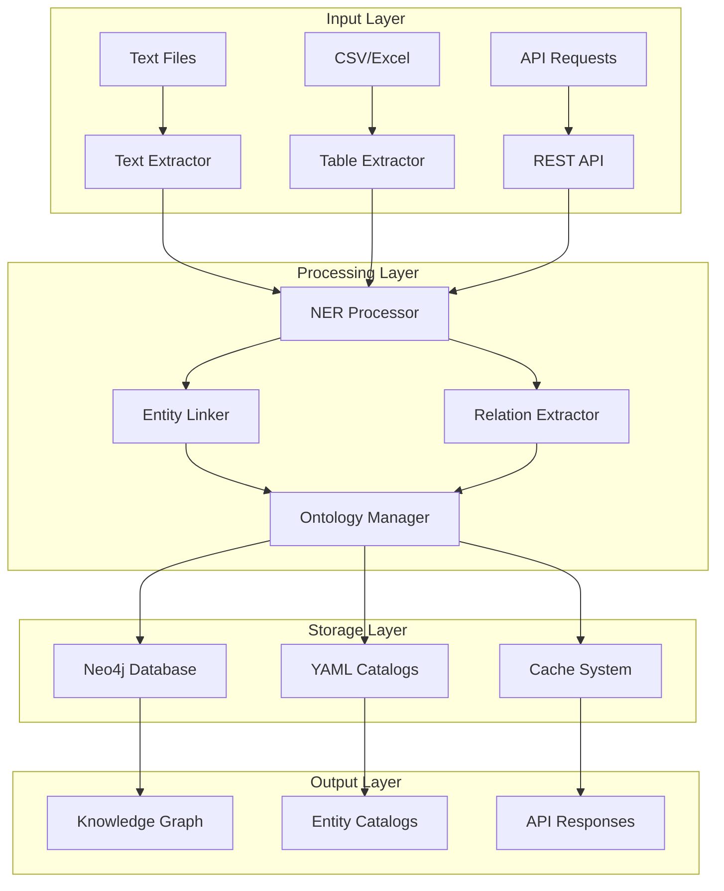

# AutoGraph - Umfassende Dokumentation

**Automatische Knowledge Graph Generierung mit KI-gestützter Entity-Extraktion und Relation-Mining**

---

## 📚 Dokumentations-Übersicht

Willkommen zur vollständigen AutoGraph-Dokumentation! Diese Sammlung erklärt alle Aspekte von AutoGraph - von der API-Nutzung über CLI-Tools bis hin zur internen Graph-Funktionalität.

### 🎯 Schnellstart-Links

| Bereich | Beschreibung | Dokument |
|---------|--------------|----------|
| **🚀 API-Referenz** | REST API Endpunkte, Request/Response Beispiele | [API-Dokumentation](./API-Documentation.md) |
| **⚡ CLI-Tools** | Kommandozeilen-Tools für YAML-Generierung und Verarbeitung | [CLI-Dokumentation](./CLI-Documentation.md) |
| **🧠 Graph-Funktionalität** | Knowledge Graph Architektur und Algorithmen | [Graph-Dokumentation](./Graph-Documentation.md) |
| **🔧 Setup & Installation** | Installation, Konfiguration und Deployment | [Setup-Anleitung](./Setup-Guide.md) |
| **📖 Tutorials** | Schritt-für-Schritt Anleitungen und Beispiele | [Tutorial-Sammlung](./Tutorials.md) |
| **🛠️ Entwickler-Guide** | Architektur, Erweiterungen und Entwicklung | [Entwickler-Dokumentation](./Developer-Guide.md) |

---

## 🎯 Was ist AutoGraph?

AutoGraph ist ein **KI-gestütztes System zur automatischen Knowledge Graph-Generierung** aus unstrukturierten Textdaten. Es kombiniert modernste NLP-Techniken mit regelbasierten Ansätzen für präzise Entitäts-Extraktion und Beziehungs-Mining.

### 🌟 Hauptfunktionen

**🔍 Entity Recognition & Linking**
- BERT-basierte Named Entity Recognition (NER)
- Offline-First Entity Linking mit Custom YAML-Katalogen
- Automatische Entitäts-Disambiguierung
- Multi-Domain Support (Medizin, Wirtschaft, etc.)

**🕸️ Relation Extraction**
- Hybrid-Ansatz: ML + Regelbasierte Systeme
- BERT-basierte Relation Classification
- Ensemble-Methoden für höhere Präzision
- Confidence-basierte Filterung

**🧠 Ontologie-Integration**
- Custom YAML-Ontologien
- Automatisches Entity-zu-Ontologie-Mapping
- Schema.org Kompatibilität
- Namespace-Management

**🚀 Enterprise-Ready**
- REST API mit FastAPI
- Neo4j Graph Database Integration
- Air-Gapped System Support
- Batch-Processing Capabilities

---

## 🏗️ Architektur-Überblick



### 🔧 Technologie-Stack

| Komponente | Technologie | Zweck |
|------------|-------------|-------|
| **NLP Framework** | spaCy, Transformers (BERT) | Entity Recognition, Relation Extraction |
| **Web Framework** | FastAPI | REST API Server |
| **Database** | Neo4j | Graph Storage |
| **Configuration** | YAML | Entity Catalogs, Ontologien |
| **CLI Tools** | argparse, Click | Command Line Interface |
| **Data Processing** | pandas, numpy | Tabellen-Verarbeitung |

---

## 🚀 Schnellstart

### 1. **API verwenden**
```bash
# Server starten
python -m uvicorn src.autograph.api.server:app --reload --port 8001

# Text verarbeiten
curl -X POST "http://localhost:8001/process/text" \
  -H "Content-Type: application/json" \
  -d '{"text": "Aspirin hilft gegen Kopfschmerzen", "domain": "medizin"}'
```

### 2. **CLI verwenden**
```bash
# Entity-Katalog aus Textdateien generieren
python autograph_cli.py yaml entity-from-text --domain medizin --files *.txt

# Interaktiver Wizard
python autograph_cli.py yaml wizard
```

### 3. **Graph erkunden**
```cypher
// Neo4j Query: Alle medizinischen Entitäten finden
MATCH (n:Entity {domain: "medizin"}) 
RETURN n.name, n.type, n.description
```

---

## 📋 Dokumentations-Struktur

### **Detaillierte Dokumentation**

#### 🚀 [API-Dokumentation](./API-Documentation.md)
Komplette REST API Referenz mit allen Endpunkten:
- **Text Processing** - `/process/text`, `/process/table`, `/process/batch`
- **Entity Linking** - `/entity-linking/status`, `/entity-linking/link-entity`
- **Ontology Management** - `/ontology/status`, `/ontology/map-entity`
- **System APIs** - `/health`, `/cache/stats`, `/pipeline/status`

#### ⚡ [CLI-Dokumentation](./CLI-Documentation.md)
Vollständige Command Line Interface Referenz:
- **YAML Generator** - Automatische Katalog-Erstellung
- **Text Processor** - Pipeline-Integration
- **API Client** - REST API Interaction
- **Validation Tools** - Qualitätsprüfung

#### 🧠 [Graph-Dokumentation](./Graph-Documentation.md)
Knowledge Graph Architektur und Algorithmen:
- **Graph Schema** - Neo4j Datenmodell
- **Entity Types** - Entitäts-Kategorisierung
- **Relation Types** - Beziehungs-Taxonomie
- **Query Patterns** - Cypher Query Beispiele

#### 🔧 [Setup-Anleitung](./Setup-Guide.md)
Installation und Konfiguration:
- **System Requirements** - Abhängigkeiten und Voraussetzungen
- **Installation Steps** - Schritt-für-Schritt Setup
- **Configuration** - Konfiguration von Neo4j, YAML-Katalogen
- **Deployment** - Produktions-Deployment

#### 📖 [Tutorial-Sammlung](./Tutorials.md)
Praktische Anleitungen und Beispiele:
- **Medizinische Textanalyse** - Schritt-für-Schritt
- **Wirtschaftsdaten-Processing** - CSV zu Knowledge Graph
- **Custom Entity Catalogs** - Eigene Kataloge erstellen
- **Ontologie-Entwicklung** - YAML-Ontologien designen

#### 🛠️ [Entwickler-Dokumentation](./Developer-Guide.md)
Für Entwickler und Erweiterungen:
- **Code Architecture** - Interne Struktur
- **Extension Points** - Plugin-Entwicklung
- **Testing Framework** - Unit Tests und Integration Tests
- **Performance Optimization** - Optimierungsstrategien

---

## 🎯 Use Cases

### **🏥 Medizinische Textanalyse**
- **Klinische Notizen** → Entitäten (Medikamente, Diagnosen, Symptome)
- **Forschungspapers** → Beziehungen zwischen Wirkstoffen
- **Patientendaten** → Behandlungsverläufe als Graph

### **💼 Wirtschaftsdatenanalyse**
- **Unternehmensdaten** → Firmen-Netzwerke und Beziehungen
- **Marktanalysen** → Branchen-Connections
- **Finanzberichte** → Geld- und Investitionsströme

### **📰 News & Social Media**
- **Nachrichtenartikel** → Personen, Orte, Ereignisse
- **Social Media Posts** → Trend-Analyse und Sentiment
- **Wissenschaftliche Publikationen** → Zitations-Netzwerke

---

## 🤝 Support & Community

### **Dokumentation**
- 📚 **Vollständige Docs**: Siehe verlinkte Unterdokumente
- 🔍 **API Explorer**: `http://localhost:8001/docs` (Swagger UI)
- 📖 **Examples**: Beispiele in jedem Unterdokument

### **Entwicklung**
- 🐛 **Issues**: GitHub Issues für Bugs und Feature Requests
- 🚀 **Contributions**: Pull Requests willkommen
- 💬 **Discussions**: GitHub Discussions für Fragen

### **Enterprise Support**
- 🏢 **Custom Deployments**: Air-Gapped Systeme
- 🔧 **Custom Integrations**: API-Erweiterungen
- 📊 **Performance Tuning**: Optimierungen für große Datasets

---

## 🚀 Nächste Schritte

1. **📖 Setup**: Beginnen Sie mit der [Setup-Anleitung](./Setup-Guide.md)
2. **🚀 API testen**: Nutzen Sie die [API-Dokumentation](./API-Documentation.md)
3. **⚡ CLI ausprobieren**: Siehe [CLI-Dokumentation](./CLI-Documentation.md)
4. **🧠 Graph verstehen**: Lesen Sie die [Graph-Dokumentation](./Graph-Documentation.md)

**🎯 Bereit für AutoGraph? Starten Sie mit dem [Setup-Guide](./Setup-Guide.md)!**
